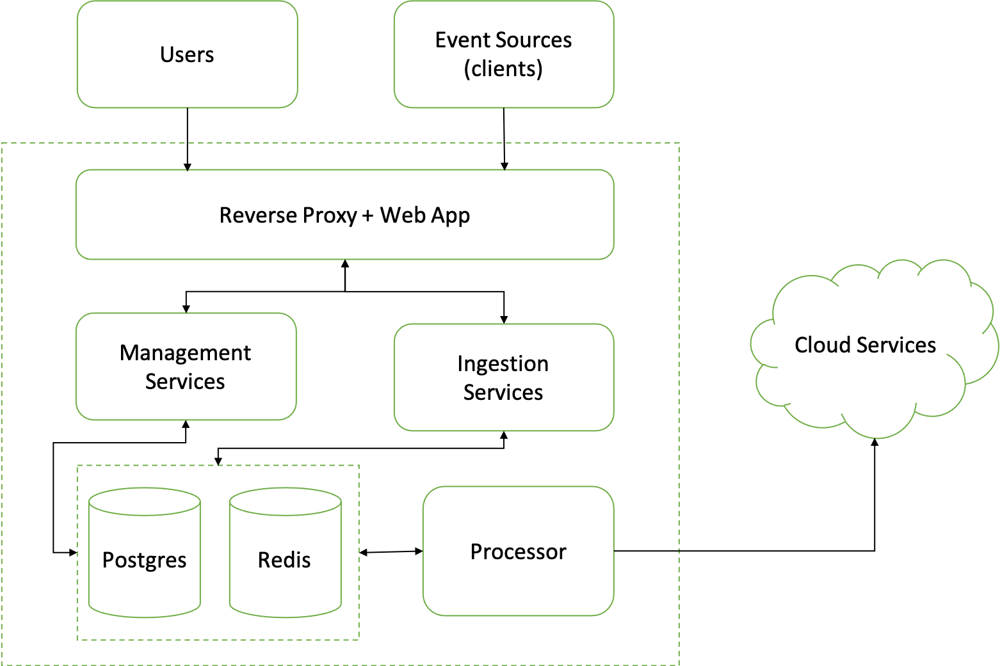

# Product Architecture

The following picture represents the high-level product architecture.

### Management Services (Spring boot application)

Management Services allows users to interact with the system and create the required entities in the system. This service is responsible for exposing the REST APIs consumed by the Web application, running scheduled jobs for purging stale data and downloading Apps.

### Ingestion Services (Spring boot application)

Ingestion Services expose the HTTP APIs for data sources to send events into the Platform for processing in the Pipeline. This service is also responsible for processing ingested events and delivering them to the Pipelines for further processing.

### Processor (NodeJS Application)

Processor is the service that processes queued events in the Pipeline. This service is responsible for executing the transformations and destination scripts for the events and updates the status for each event.

### Reverse Proxy (Caddy Server)

All the HTTP calls into the platform are routed through the reverse proxy. This service also hosts the Web application (React App). We use Caddy as the reverse proxy which can automatically provision SSL certificates for the configured end points.