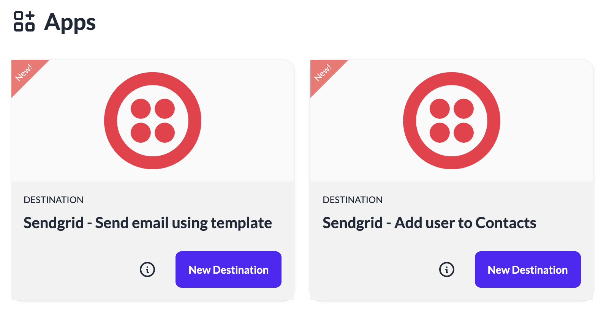

# Create a Destination from Apps
You can create new a destination from existing ready to use Apps. These Apps are open source and contributed by the community to help build integrations easily.

To create a new Destination from Apps:

1. Login to your instance of the platform.
2. Click **Apps** in the left navigation.
3. All the apps downloaded into your instance are listed in this page.

4. Click **info** icon on the tile to see the details of the destination.
5. Click **New Destination** button on any tile to create a new destination.
6. A new destination will be created from the App.
7. Update the configuration properties or the script in the newly created destination as per your requirements.
8. Click **Save changes**