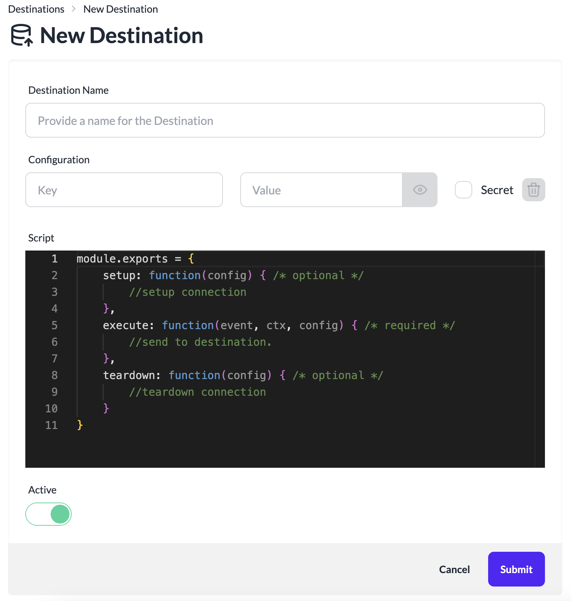

# Create a Destination
A Source is the point of entry for data into the platform for processing and delivery to a Destination. Every Source created will have a unique HTTP data ingestion end point for sending the data from services.

To create a new Destination:

1. Login to the platform.
2. Click **Destinations** in the left navigation.
3. Click **New Destination**.

4. Provide a name for the Destination.
5. Add any required configuration parameters for the destination.
    - Set **Secret** to checked for storing sensitive confguration parameters. This data will be stored encrypted in the database.
6. Update the default **Script** for sending the event data to your target Destination service.
    - `Setup` method is optional for setting up a connection to your destination service. Configuration setup for the destination will be passed into this method as `config`
    - `execute` method is required and will be invoked for sending data to your destination service. Current event data, context and configuration `(event, ctx, config)` are passed as parameters while invoking this method.
    - `teardown` method is optional for removing the previously created connection. Configuration setup for the destination will be passed into this method as `config`
7. Click **Submit** to create the Destination.
