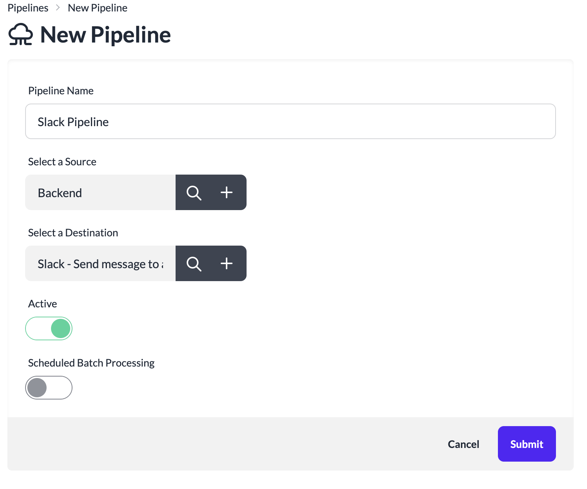

# Create a Pipeline

A pipeline donotes flow of data from source to destination. A pipeline can have multiple transformations in between.

Pipelines can be used to move data from one system to another, or to enrich data with additional information, or to remove sensitive information from the event payload.

Pipelines can be scheduled to run at a specific time or can be triggered to run for individual events.

To create a new Pipeline:

1. Login to your instance of the platform
2. Click **Pipelines** in the left navigation.
3. Click **New Pipeline**.

4. Provide a name for the Pipeline.
5. Select a Source for the Pipeline. Any events sent to the selected Source will be sent to this Pipeline.
6. Select a Destination for the Pipeline.
7. Toggle **Scheduled Batch Processing** to ON for processing events to the pipeline in batched on a schedule. Set **Scheduled Batch Processing** to OFF for processing the pipeline events individually as they come.
8. Click **Submit**

## Data retention

The default data retention interval for inbound and outbound events in the Platform is **3 days**. Ensure that events in the pipelines are processed within this default interval to avoid any data loss.

You can update the default retention interval if required. Refer Settings for more details.