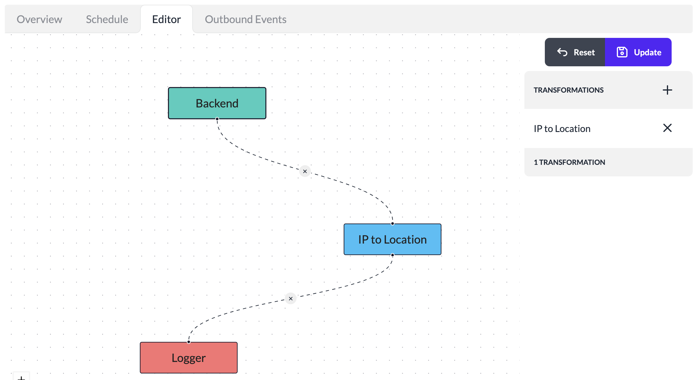

# Pipeline Editor

A newly defined pipeline will only connect the selected Source and Destination without any data transformations. Any events received by such pipelines will directly invoke the destination script.

Pipelines can be edited to add transformations while the data is flowing through the pipeline. Transformations allow enriching the event data, strip off or redact any sensitive data or drop the entire event from further processing in a pipeline.

To edit a Pipeline to change the data flow:

1. Login to your instance of the platform
2. Click **Pipelines** in the left navigation.
3. Select the Pipeline to edit from the list.
4. Click **Editor** tab.

5. Click **+** icon under **Transformations** section to add a transformation to a pipeline.
6. The newly selected transformation will be shown on the editor.
7. Hover the mouse cursor near the Destination node to click and drag the edge connecting the Source and Destination. Drop the edge to the newly added Transformation node.
8. Drag from the bottom of the transformation to create a new edge from Transformation to the Destination.
9. This changes the data flow in the Pipeline to invoke the transformation before the data reaches the destination script.
10. Add additional transformations to the pipeline and create new edges connecting the nodes to update the pipeline data flows.