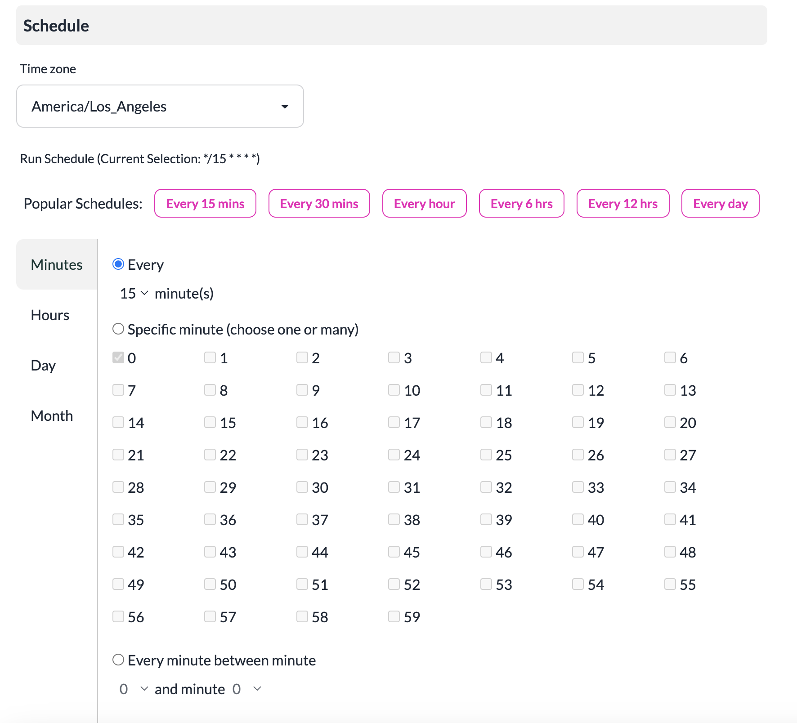

# Pipeline Schedules

Pipelines configured with **Scheduled Batch Processing** enabled can have a schedule associated for processing events in the pipeline. 

The minimum interval for processing events in a pipeline is **5 minutes**. The schedule editor supports creating complex schedules to run on specific days, times or at different time zones. 

:::danger
The default data retention interval for inbound and outbound events in the Platform is **3 days**. Ensure that your pipeline processing schedules consider this retention interval. For example: If you are scheduling to process your pipeline on a weekly basis, you must change the default data retention interval for the platform so the events are not deleted before they are processed.
:::

