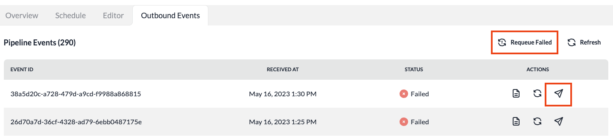

# Processing Failed Events

Events sent to a Pipeline are attempted to be processed by the event processor. If the processor encounters an exception while processing the event in the pipeline's transformers or the Destination, the event will be marked as 'Failed' in the Outbound event.

These failed events are required to be requeued manually for reattempting the processing for those failed events. Although we are looking to provide automated requeuing mechanisms in the future releases.

:::note
Make sure you identify the underlying issue that caused the failure before requeuing the events. For example: if a fix is required in a Transformer or the Destination, fix the issue and then requeue the events for processing.
:::

## Requeuing Events

### Requeue a single event

1. Navigate to the Pipeline page with failed events.
2. Click **Outbound Events** tab.
3. The list shows recently failed events.
4. Click the **Requeue event** button on the failed event row.
5. The event's state will be updated to 'Queued'.
6. This event will be attempted to be reprocessed by the event processor.

### Requeue all failed events

1. Navigate to the Pipeline page with failed events.
2. Click **Outbound Events** tab.
3. The list shows recently failed events.
4. Click **Requeue Failed** button.
5. All the events in the pipeline that are currently in **Failed** state will be requeued for processing.
6. The requeued events will be attempted to be reprocessed by the event processor.

