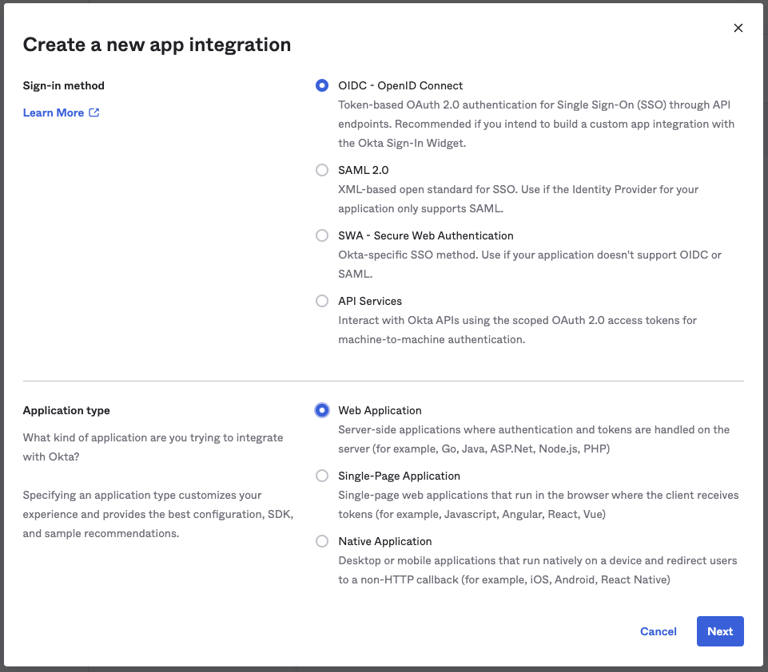
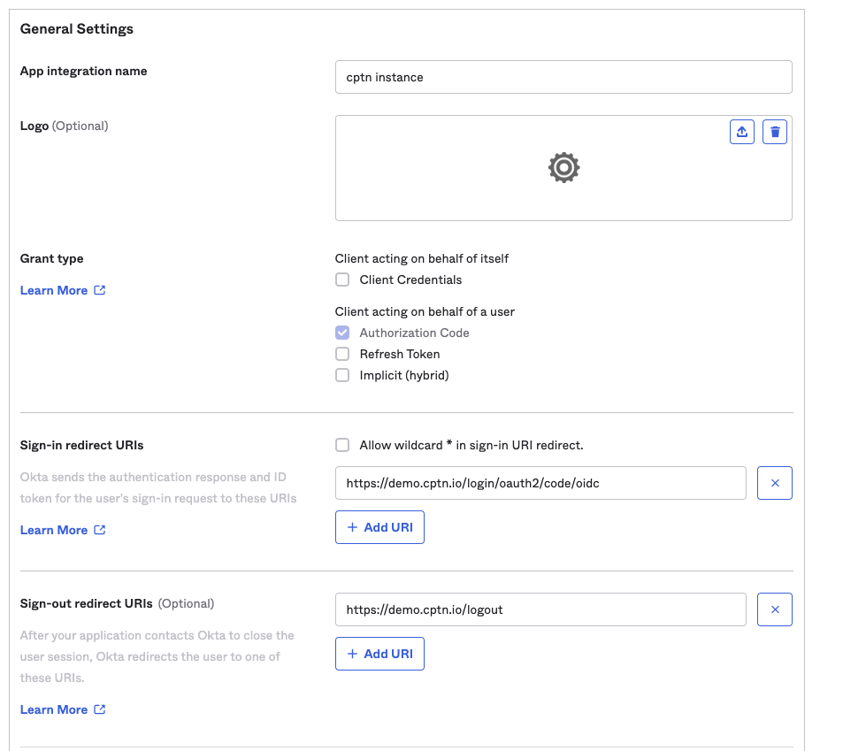
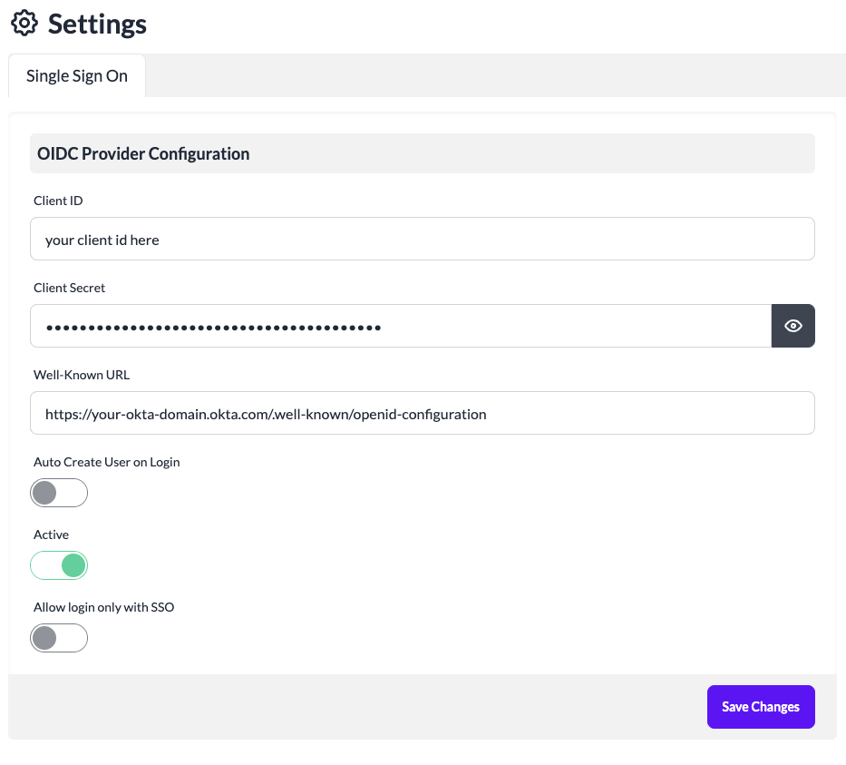

# Setting up SSO with Okta

This guide walks you through the setup process for enabling Single Sign-On (SSO) for your instance with Okta. Once the SSO is configured for your instance, users will be redirected to your configured Okta identity provider domain to complete the login.

We support SSO login to cptn.io instance using **OAuth/OpenID Connect (OIDC)**.

## Setup Instructions

### In cptn.io instance

1. Login to your cptn.io instance.
2. Navigate to **Settings** page from left nav.
3. Click **Single Sign-On** tab on the page.
4. A SSO Configuration page will be displayed.
5. Copy the **Redirect URI** shown for your instance. This URL will be used for defining configuration in your identity provider.

### In Okta
1. Login to Okta admin portal via https://developer.okta.com
2. Click **Applications** in the left nav.
3. Click **Create App Integration** button.
4. Select Sign-in method as **OIDC - OpenID Connect**.
5. Select Application Type as **Web Application**.

6. Click **Next**
7. Provide a name for the App integration. (e.g. cptn instance)
8. Provide the previously copied Redirect URI to **Sign-in redirect URIs** field.
9. Provide the Sign-out redirect URIs as `https://${your-cptn-instance-url}/logout`
10. Select appropriate option for **Assignments** based on who should be granted access to your cptn instance.

11. Click **Save**
12. Copy the generated **Client ID** and **Client Secret** from the page.
13. Navigate to Assignments to assign users/groups to this configuration.

(Optional)
#### To allow login to be initiated from Okta, under LOGIN section:
14. Change **Login initiated by** to **Either Okta to App**
15. Set **Initiate login URI** as `https://${your-cptn-instance-url}/login?sso=true`

### Back in cptn.io instance
1. Login to your cptn.io instance.
2. Navigate to **Settings** page from left nav.
3. Click **Single Sign-On** tab on the page.
4. A SSO Configuration page will be displayed.
5. Provide the **Client ID** copied from Okta portal
6. Provide the **Client Secret** copied from Okta portal.
7. Provide OIDC Configuration Well-Known URL for your Okta domain. The Well-Known URL for Okta is in the format: `https://${yourOktaDomain}/.well-known/openid-configuration`. For example: https://foo-bar.okta.com/.well-known/openid-configuration

8. Toggle **Active** to ON.
9. Leave **Allow login only with SSO** to OFF for now until the SSO configuration is tested.
10. To support creating users on your cptn.io instance on first login via SSO, set **Auto Create User on Login** to ON.
11. Click **Save Changes**

The SSO configuration is now complete. You can now logout and try logging using your SSO credentails.

:::note
Once you confirm that the SSO based login is successful, remember to update the SSO configuration to set **Allow login only with SSO** to ON to disable Password-based login to your instance.
:::