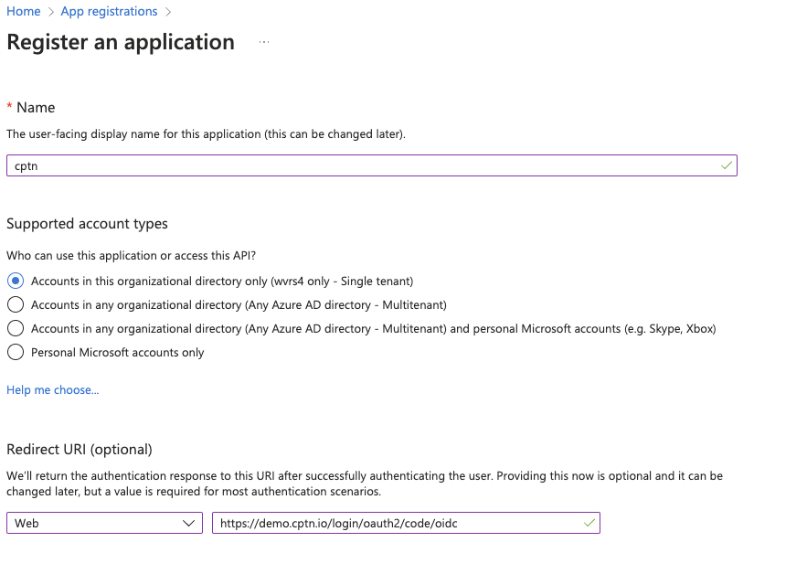
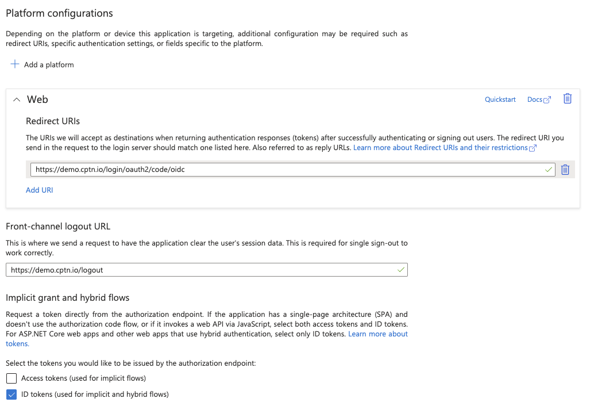
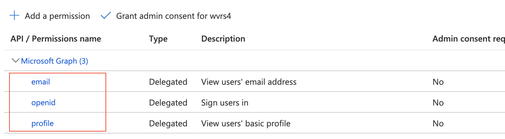
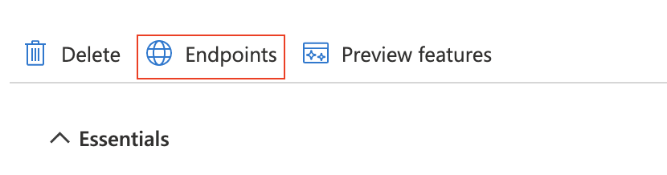

# Setting up SSO with Azure AD

This guide walks you through the setup process for enabling Single Sign-On (SSO) for your instance with Microsoft Azure Active Directory (Azure AD). Once the SSO is configured for your instance, users will be redirected to your configured Azure AD identity provider to complete the login.

We support SSO login to cptn.io instance using **OAuth/OpenID Connect (OIDC)**.

## Setup Instructions

### In cptn.io instance

1. Login to your cptn.io instance.
2. Navigate to **Settings** page from left nav.
3. Click **Single Sign-On** tab on the page.
4. A SSO Configuration page will be displayed.
5. Copy the **Redirect URI** shown for your instance. This URL will be used for defining configuration in your identity provider.

### In Azure Portal
#### Create App Registration
1. Login to https://portal.azure.com
2. In the top search menu, search for **App registrations**.
3. Click **App registrations** from the list shown.
4. Click **New registration** button on the page.
5. Provide a name for the application. E.g. cptn.io - Dev Team
6. Select **Accounts in this organizational directory only**
7. Under Redirect URI, Select **Web** from the *Select a Platform* dropdown
8. Provide the copied **OAuth Redirect URI** as the Redirect URI.

9. Click **Register**
10. A new App registration will be created.

#### Configuring Authentication Properties
11. Click **Authentication** in the left nav menu.
12. Provide `https://${your-cptn-instance-url}/logout` as **Front-channel logout URL**.
13. Select **ID tokens (used for implicit and hybrid flows)** under *Implicit grant and hybrid flows* section.
14. Click **Save**

#### Configuring Permissions
15. Click **API Permissions** from the left nav menu.
16. Remove **User.Read** permission if it's already available in the list of API/Permissions names.
17. Click **Add a permission** button.
18. A new fly-in page will be displayed. Click **Microsoft Graph** tile.
19. Click **Delegated permissions** tile.
20. Select **Openid**, **email**, **profile** from the list of permissions.
21. Click **Add permissions**

#### Creating a Client Secret.

22. Click **Certificates & secrets** from the left nav menu.
23. Click **New client secret** button.
24. Provide a **name** for the secret and select an appropriate **Expires** interval. Note that, you must generate a new client secret and update your SSO configuration in your cptn instance before the expiry of this secret.
25. Copy the generated **Value** of the **client secret**. This is the value to be used as **Client Secret** below.
26. Click **Overview** from the left navigation menu.
27. Copy **Application (client) ID** value. This is the value to be used as **Client ID** below.
28. Click **Endpoints** button.

28. A fly-in page will be displayed.
29. Copy the url for **OpenID Connect metadata document**. This url ends with */.well-known/openid-configuration*

### Back in cptn.io instance
1. Login to your cptn.io instance.
2. Navigate to **Settings** page from left nav.
3. Click **Single Sign-On** tab on the page.
4. A SSO Configuration page will be displayed.
5. Provide the **Client ID** copied from Azure portal
6. Provide the **Client Secret** copied from Azure portal.
7. Provide OIDC Configuration **Well-Known URL** for your Azure AD domain.
8. Click **Save Changes**.

The SSO configuration is now complete. You can now logout and try logging using your SSO credentails. 

:::note
Once you confirm that the SSO based login is successful, remember to update the SSO configuration to set **Allow login only with SSO** to ON to disable Password-based login to your instance.
:::