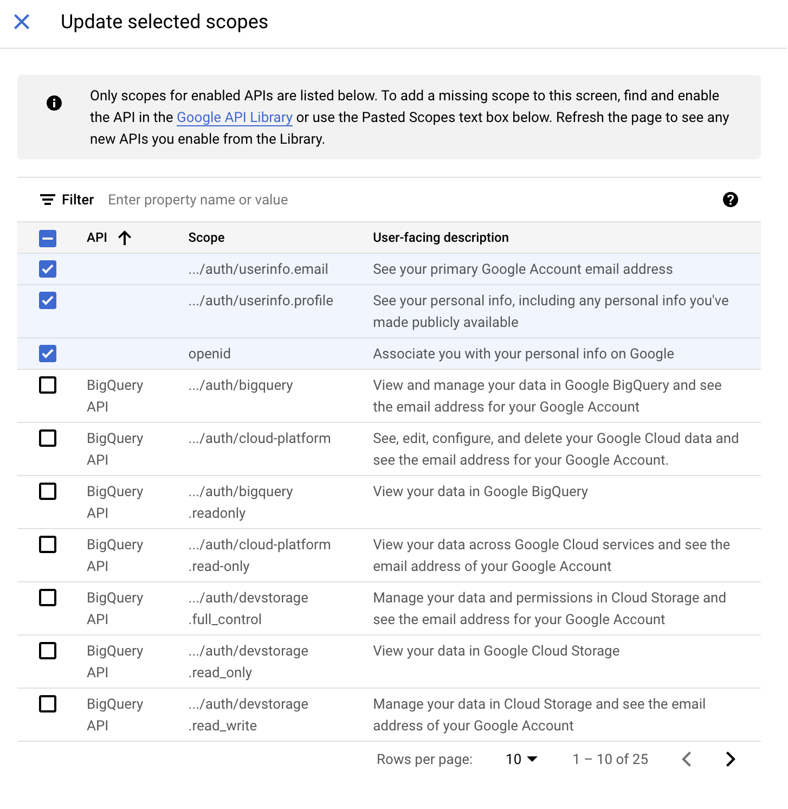
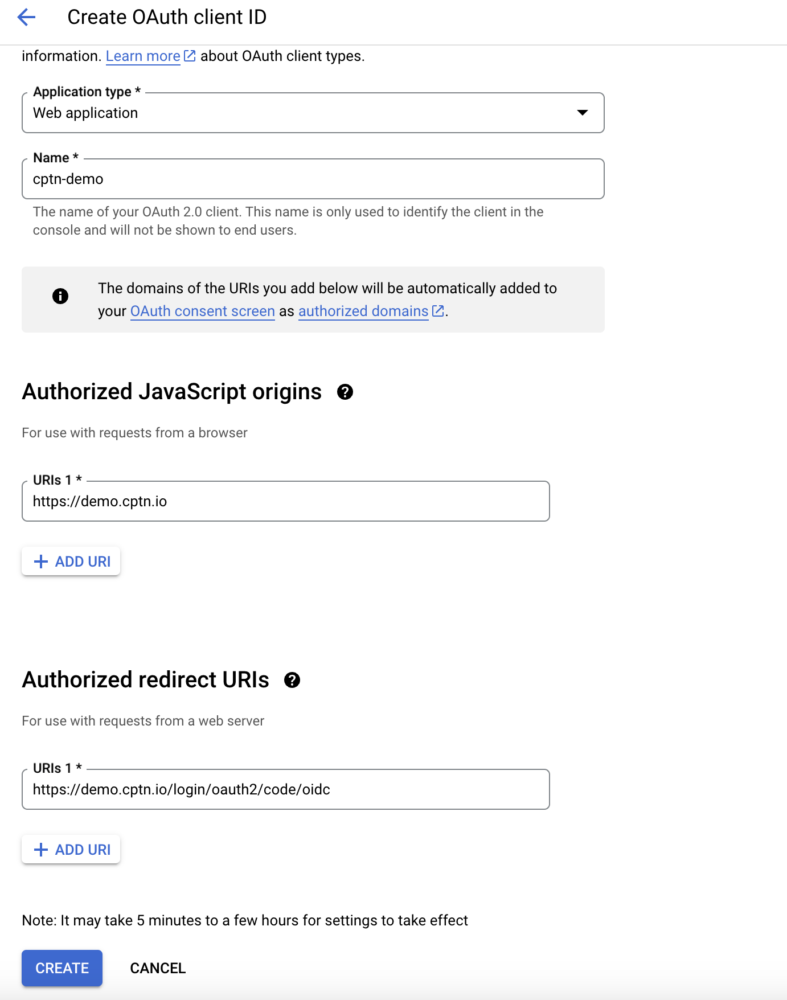
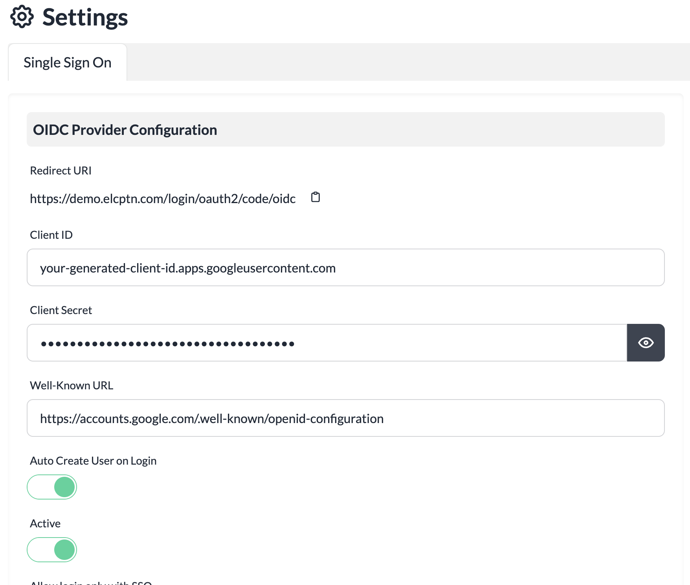

# Setting up SSO with Google Workspace

This guide walks you through the setup process for enabling Single Sign-On (SSO) for your instance with Google Workspace. Once the SSO is configured for your instance, users will be redirected to your configured Google Workspace domain to complete the login.

We support SSO login to cptn.io instance using **OAuth/OpenID Connect (OIDC)**.

## Setup Instructions

### In cptn.io instance

1. Login to your cptn.io instance.
2. Navigate to **Settings** page from left nav.
3. Click **Single Sign-On** tab on the page.
4. A SSO Configuration page will be displayed.
5. Copy the **Redirect URI** shown for your instance. This URL will be used for defining configuration in your identity provider.

### In Google Workspace
1. Login to your [Google console](https://console.cloud.google.com/) and create a new project.
2. Navigate to [OAuth consent screen](https://console.cloud.google.com/apis/credentials/consent). Ensure that correct project is selected.
3. Select **User Type** as Internal
4. Provide an **App name**. e.g. cptn-prod
5. Provide the base domain where you have hosted your cptn.io instance as an **Authorized domain**.
6. Provide other required information on the form.
7. Click **Save and Continue**
8. Click **Add OR Remove Scopes**
9. Select **openid**, **profile**, **email** scopes from the list in the flyout panel.

10. Click **Update** on the flyout panel.
11. Click **Save and Continue**
12. Verify the configuration is valid in the **Summary** page.
13. Navigate to Google Console [Credentials](https://console.cloud.google.com/apis/credentials) page. 
14. Click **Create Credentials** and select **OAuth Client ID**.
15. Provide your base domain as **Authorized JavaScript origins**. For example, if you are hosting your instance at https://demo.example.com, provide this domain url as the value.
16. Provide the previously copied Redirect URI as **Authorized redirect URIs**.

17. Click **Create** button
18. Copy the generated **Client ID** and **Client Secret** values.

### Back in cptn.io instance
1. Login to your cptn.io instance.
2. Navigate to **Settings** page from left nav.
3. Click **Single Sign-On** tab on the page.
4. A SSO Configuration page will be displayed.
5. Provide the **Client ID** copied from Google Console.
6. Provide the **Client Secret** copied from Google Console.
7. Provide OIDC Configuration Well-Known URL for your Google Workspace. The Well-Known URL for Google Workspaces is `https://accounts.google.com/.well-known/openid-configuration`.

8. Toggle **Active** to ON.
9. Leave **Allow login only with SSO** to OFF for now until the SSO configuration is tested.
10. To support creating users on your cptn.io instance on first login via SSO, set **Auto Create User on Login** to ON.
11. Click **Save Changes**

The SSO configuration is now complete. You can now logout and try logging using your SSO credentails.

:::note
Once you confirm that the SSO based login is successful, remember to update the SSO configuration to set **Allow login only with SSO** to ON to disable Password-based login to your instance.
:::