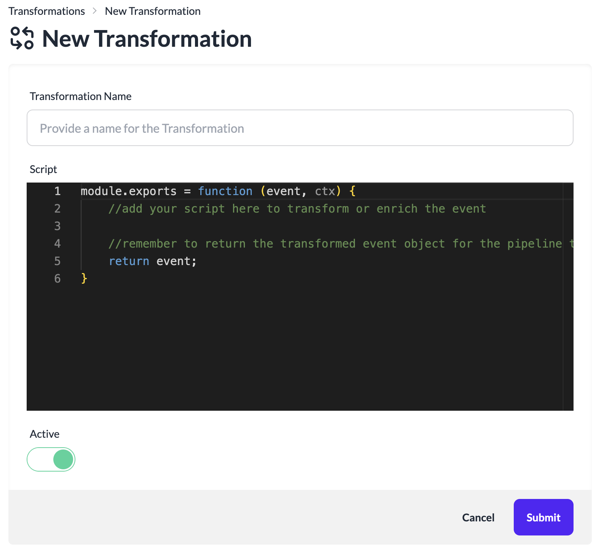

# Create a Transformation
Transformations help with enriching and removing sensitive data from your event payload. Add any Javascript code with required npm JS modules to transform your payloads.

Remember that Transformations must return updated event payload for the event data to move across all the Pipeline steps. Pipeline will stop processing an event if a Transformation does not return the event object.

To create a new Transformation:

1. Login to the platform.
2. Click **Transformations** in the left navigation.
3. Click **New Transformation**.

4. Provide a name for the Transformation.
5. Modify the script to update the event data. Following is an example transformation script that resolves location from an IP address. Remember that passed in event object must be updated for doing any changes to the event data.

```js
var geoip = require('geoip-lite');

module.exports = function (event, ctx) {
    const ip = event.ip;
    if (ip) {
        event.location = geoip.lookup(ip);
    }
    
    return event;
}
```
6. Update the passed event object as required in the transformation.

:::caution
We only support mutating the passed event object in a transformation for processing in the pipelines.
Do not return a new object in a transformation. 
:::

7. To filter out or stop an event for further processing in a pipeline, return null from a transformation. No further processing will be done on that event in the pipeline.

```js

module.exports = function (event, ctx) {
    return null
}

```